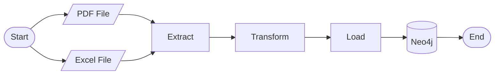
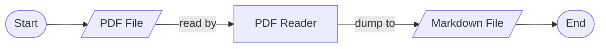
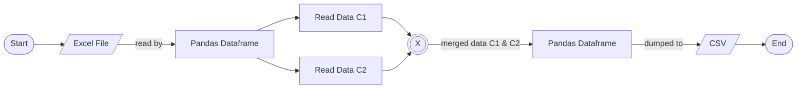
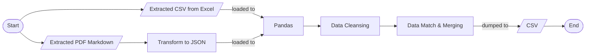

# ETL Graph DB for Building Management System

This is an example ETL repository for a system to extract the Building Management System data, transform it into a structured data, load it into a Graph Database, and visualize it.

:computer: _Data Scientist_: Jalaluddin Al Mursyidy Fadhlurrahman

## Environment
### Production
:bar_chart: Data Visualization: [Click here!](http://103.185.52.183:8503/)

## Tools
- Data Visualization: Streamlit
- Graph Database: Neo4j
- Raw Data Ingestion from PDF: Gemma3 4b via Ollama

## Flowcharts
### General Logic

### Extraction Logic
#### PDF File

#### Excel File

### Transformation Logic

